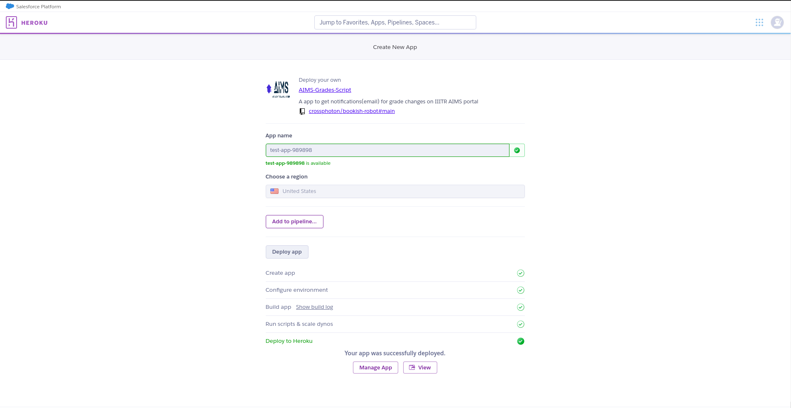
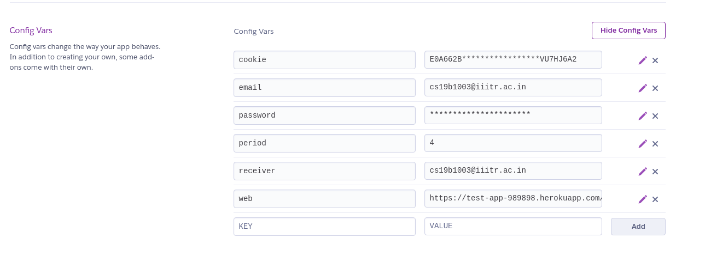
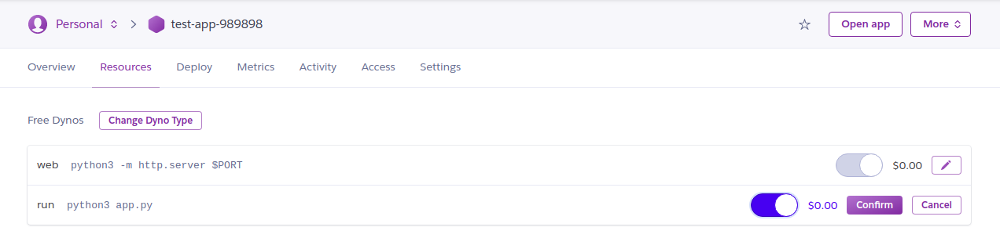
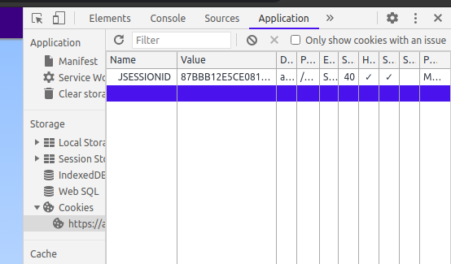
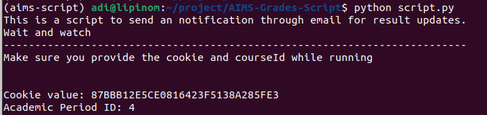

[](https://heroku.com/deploy?template=https://github.com/crossphoton/AIMS-Grades-Script/tree/test-heroku)

# AIMS-Grades-Script

**Exculsively for IIIT Raichur students

** Can be used for other institute AIMS portal too. Change the url for that. (Eg. IITH, IIIT Dharwad [Didn't tried it though])

By running this script you don't have to check for your grades again and again on the institute AIMS portal, instead you'll get an email whenever there's an update

## How to use (Heroku - obv better)

Click on the deploy button above and create an app.



Now Manage app --> settings --> Reveal Config Vars

Add following variables
```
cookie (As shown below)
email (Gmail account email address to send email)
password (Password for given gmail account [Use app passwords])
period (Academic Period)
reciever (Reciever's email address)
web (your app url[Use open app button])
```


(Get the cookie value as shown below)

Lastly Resources --> edit run process --> Turn on switch --> Confirm


Make sure the cost is zero......xD (It'll be though)

## How to use (local/self hosted)

Install python requirements.

### Get cookie value

Login into AIMS portal and pull out the cookie **value** using your browser's Dev Tools.


### Setting required fields

Set the following fields in the script. (Comments are written after these variables)

```
email
password
from
to
```

### Running the script

Run the script using Python v3.

`python3 script.py`

Enter cookie **value** and academic period id. (Generally it's the semester number but for 3rd sem it is 4, don't know why)



The script will start and will send an email when any of the course grades are changed

Output:
```
[2020-12-27 02:10:52.410499] 1/7 courses till now. Trying again in 10 mins.....
[2020-12-27 02:20:52.837820] 1/7 courses till now. Trying again in 10 mins.....
[2020-12-27 02:30:53.194651] 1/7 courses till now. Trying again in 10 mins.....
Successfully sent email.
[2020-12-27 02:40:53.594826] 3/7 courses till now. Trying again in 10 mins.....
.
.
.
.
.


```

Wait for the email.......

## Extras

You can change the interval accordingly in the script.

Run this in background during result time and enjoy......... (Oh wait how can you enjoy)


<br>
<br>
<br>
Bye bye.....